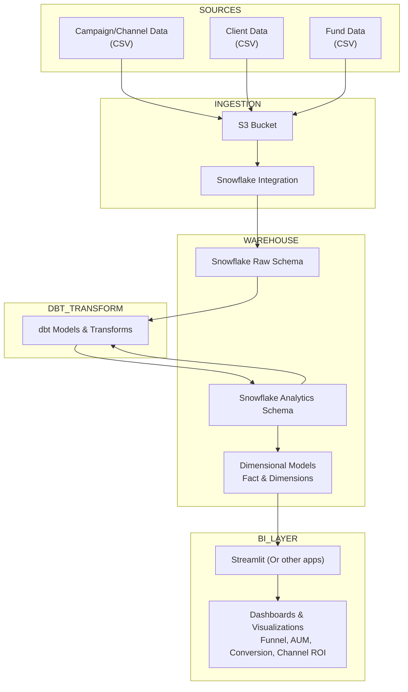

# Sample Bitwise Analytics Project

## Table of contents

- [Analytics Dashboard](#analytics-dashboard)
- [Overview](#overview)
- [How it works (high level)](#how-it-works-high-level)
- [Architecture](#architecture)
- [Design Screenshots](#design-screenshots)

## Analytics Dashboard

[Dashboard Link (Streamlit Cloud)](https://bitwise-demo.streamlit.app/)

## Overview

This project demonstrates a simple analytics pipeline:
S3 -> Snowflake -> dbt -> Streamlit.

- Ingest raw CSVs (sample data) into an S3-like stage.
- Load staged data into Snowflake (raw schema).
- Transform raw tables into analytics models using dbt.
- Expose results via a Streamlit app ([app.py](app.py)) for dashboards and exploration.

## How it works (high level)

1. Raw data (examples in CSVs [sample-data](/sample-data/)) is ingested to S3 staging.
2. COPY INTO Snowflake stage or use a small loader to ingest into a raw schema.
3. Run dbt to transform raw tables into analytics-ready models (facts and dims).
4. The Streamlit app ([app.py](app.py)) queries Snowflake to render dashboards.

### Architecture

### Design Screenshots

**AWS S3, IAM**

**Database Design**

**Snowflake**

