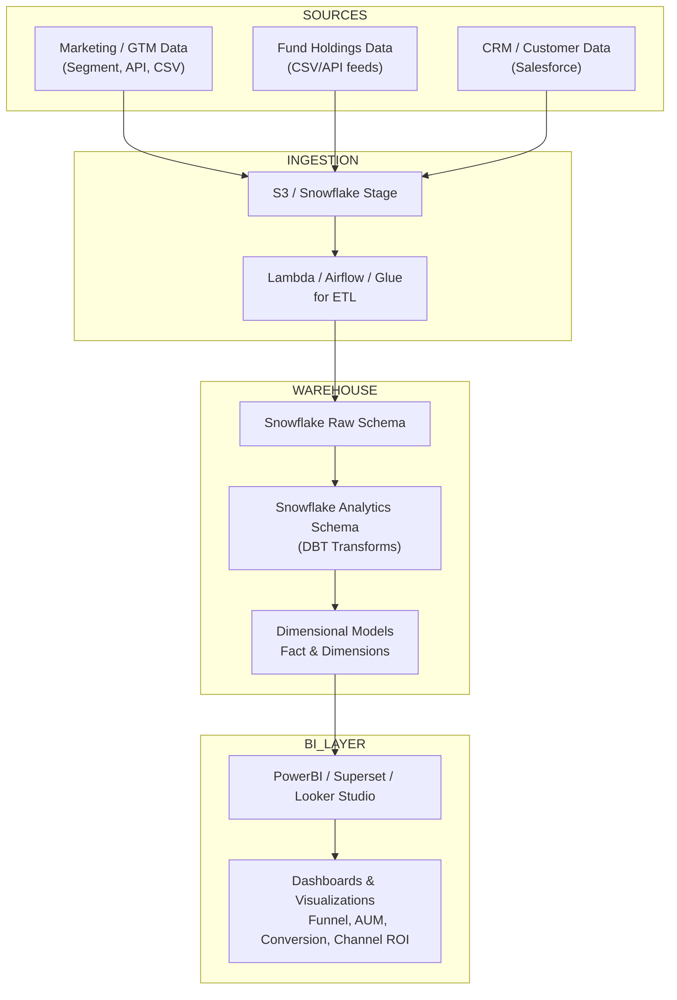

```mermaid
flowchart TD
    subgraph SOURCES
        A1["Marketing / GTM Data
        (Segment, API, CSV)"]
        A2["Fund Holdings Data
        (CSV/API feeds)"]
        A3["CRM / Customer Data
        (Salesforce)"]
    end
    subgraph INGESTION
        B1["S3 / Snowflake Stage"]
        B2["Lambda / Airflow / Glue
        for ETL"]
    end
    subgraph WAREHOUSE
        C1["Snowflake Raw Schema"]
        C2["Snowflake Analytics Schema
        (DBT Transforms)"]
        C3["Dimensional Models
        Fact & Dimensions"]
    end
    subgraph BI_LAYER
        D1["PowerBI / Superset / Looker Studio"]
        D2["Dashboards & Visualizations
        Funnel, AUM, Conversion, Channel ROI"]
    end
    %% Data Flow
    A1 --> B1
    A2 --> B1
    A3 --> B1
    B1 --> B2
    B2 --> C1
    C1 --> C2
    C2 --> C3
    C3 --> D1
    D1 --> D2
```
