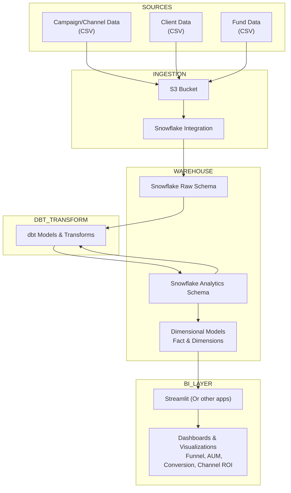

```mermaid
flowchart TD
    subgraph SOURCES
        A1["Campaign/Channel Data
        (CSV)"]
        A2["Client Data
        (CSV)"]
        A3["Fund Data
        (CSV)"]
    end
    subgraph INGESTION
        B1["S3 Bucket"]
        B2["Snowflake Integration"]
    end
    subgraph WAREHOUSE
        C1["Snowflake Raw Schema"]
        C2["Snowflake Analytics Schema"]
        C3["Dimensional Models
        Fact & Dimensions"]
    end
    subgraph DBT_TRANSFORM
        T1["dbt Models & Transforms"]
    end
    subgraph BI_LAYER
        D1["Streamlit (Or other apps)"]
        D2["Dashboards & Visualizations
        Funnel, AUM, Conversion, Channel ROI"]
    end
    %% Data Flow
    A1 --> B1
    A2 --> B1
    A3 --> B1
    B1 --> B2
    B2 --> C1
    C1 --> T1
    T1 --> C2
    C2 --> C3
    C3 --> D1
    D1 --> D2

    %% Circular reference for dbt
    C2 --> T1
```
